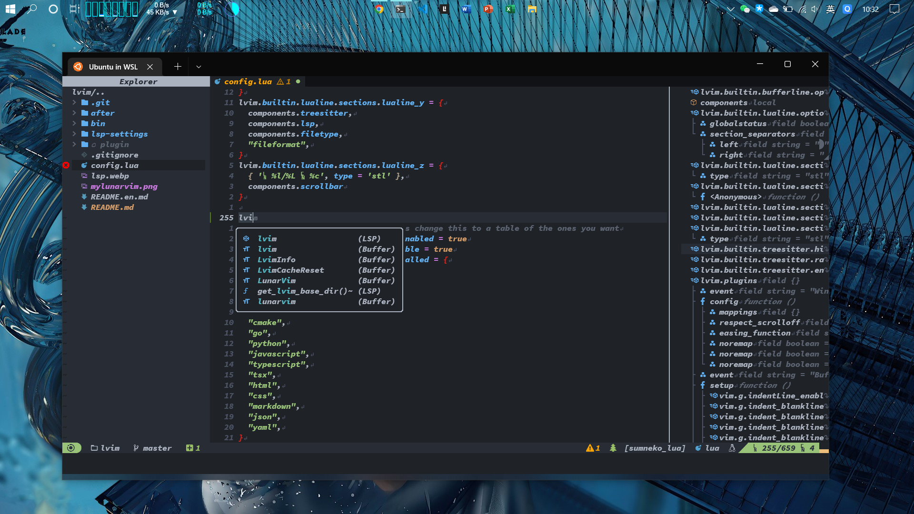

# Customized LunarVim

## Preface

Modern neovim support lua as first class language, it is much faster than viml. Based on [LunarVim](https://www.lunarvim.org/) -- A popular collection of modern neovim configurations written in lua, my neovim launch time have reduce to 187.835ms from 829.953ms.



## Install

1. Fisrt at all, you need to install [LunarVim](https://www.lunarvim.org/01-installing.html#installation). **Beware**:

   - You may need to execute: `npm set prefix ~/.local -g` to solve access permission problem without sudo
   - You may need to add ~/.cargo/bin to your PATH environment value

2. Then, install this customized config for lunarvim

   ```sh
   # backup original config
   mv ~/.config/lvim{,.bak}
   # install my config
   git clone https://github.com/mrbeardad/MyLunarVim ~/.config/lvim
   # install all plugins
   lvim --headless -c 'autocmd User PackerComplete quitall' -c 'PackerSync'
   ```

## Detail

In my lunarvim, keymaps are similar to [my vscode](https://github.com/mrbeardad/MyIDE/blob/master/vscode.md) keybinds. I have modify my windows terminal setting to remap some keys in oreder to enable ctrl+shift keys in terminal. I've marked every hacked key, feel free to modify them in [config.lua](config.lua)

```json
{
  "actions": [
    {
      "keys": "ctrl+shift+f",
      "command": {
        "action": "sendInput",
        "input": "\u001bf" // <M-f>
      }
    },
    {
      "keys": "ctrl+shift+h",
      "command": {
        "action": "sendInput",
        "input": "\u001bH" // <M-H>
      }
    },
    {
      "keys": "ctrl+alt+enter",
      "command": {
        "action": "sendInput",
        "input": "\u001b\u000d" // <M-CR>
      }
    },
    {
      "command": {
        "action": "sendInput",
        "input": "\u001bI"
      },
      "keys": "ctrl+i" // <M-I>
    },
    {
      "keys": "ctrl+shift+j",
      "command": {
        "action": "sendInput",
        "input": "\u001bJ" // <M-J>
      }
    },
    {
      "keys": "ctrl+shift+k",
      "command": {
        "action": "sendInput",
        "input": "\u001bK" // <M-K>
      }
    },
    {
      "keys": "ctrl+shift+l",
      "command": {
        "action": "sendInput",
        "input": "\u001bL" // <M-L>
      }
    },
    {
      "keys": "ctrl+shift+s",
      "command": {
        "action": "sendInput",
        "input": "\u001bS" // <M-S>
      }
    },
    {
      "keys": "ctrl+shift+o",
      "command": {
        "action": "sendInput",
        "input": "\u001bO" // <M-O>
      }
    },
    {
      "keys": "ctrl+shift+n",
      "command": {
        "action": "sendInput",
        "input": "\u001bN" // <M-N>
      }
    },
    {
      "keys": "ctrl+shift+m",
      "command": {
        "action": "sendInput",
        "input": "\u001bM" // <M-M>
      }
    },
    {
      "keys": "ctrl+.",
      "command": {
        "action": "sendInput",
        "input": "\u001b." // <M-.>
      }
    },
    {
      "keys": "ctrl+shift+p",
      "command": {
        "action": "sendInput",
        "input": "\u001bP" // <M-P>
      }
    }
  ]
}
```
