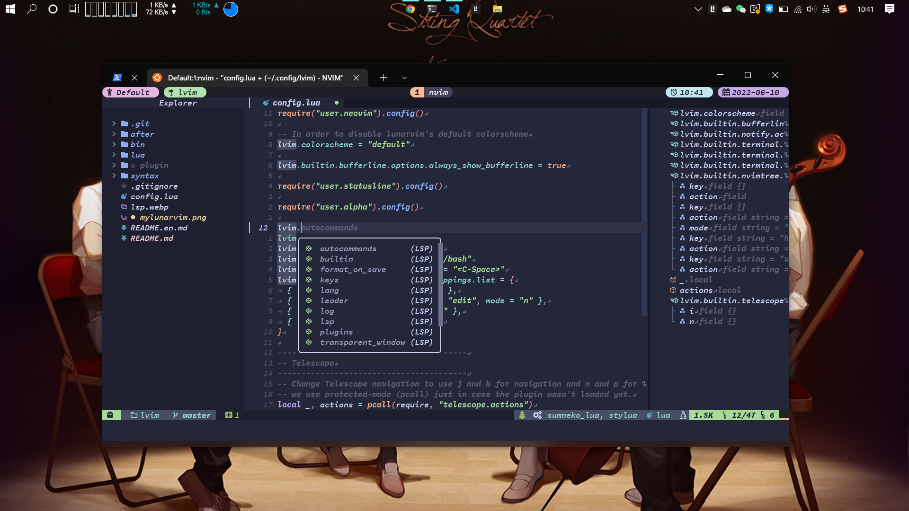
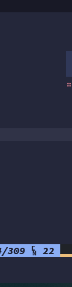

# LunarVim: Code on Neovim

[English Doc](README.en.md)



- [LunarVim: Code on Neovim](#lunarvim-code-on-neovim)
  - [前言](#前言)
  - [安装](#安装)
  - [功能介绍](#功能介绍)
    - [目录结构](#目录结构)
    - [颜色主题](#颜色主题)
    - [状态栏](#状态栏)
    - [标签栏](#标签栏)
    - [滚动条](#滚动条)
    - [其他](#其他)
  - [如何定制](#如何定制)
    - [Language Server](#language-server)
    - [Linter](#linter)
    - [Formatter](#formatter)
    - [Syntax](#syntax)
  - [快捷键](#快捷键)

## 前言

自从 NeoVim 支持[LSP](https://microsoft.github.io/language-server-protocol/)并转用[Lua](https://www.lua.org/about.html)作为首席插件语言代替又丑又慢 VimL 后，使用体验直接翻倍。
[LunarVim](https://github.com/LunarVim/LunarVim)就是基于全新 Neovim Lua 生态打造的配置集合，旨在将 Neovim 打造成高性能的 IDE。迁移到 LunarVim 后，nvim 的启动时间也大幅降低。

> **这个项目其实做了过多的适用于我个人的定制化，同时因为上游总是提交不兼容更新而我维护也不是很及时，所以其实本仓库更大的价值是用来学习和摘抄。**

## 安装

首先你需要安装[LunarVim](https://www.lunarvim.org/docs/installation)

官方的安装脚本会提示你是否需要自动安装依赖，可能会有如下问题:

1. 记得挂梯子 [(✿◡‿◡)](## "真的会谢")
2. 记得设置 npm 的 prefix 以设置可访问的全局安装路径

   ```sh
   npm config set perfix ~/.local
   ```

3. 你可能需要将 _~/.cargo/bin_ 加入你的环境变量`PATH`

然后，安装本配置:

```sh
# backup original config
mv ~/.config/lvim{,.bak}
# install my config
git clone https://github.com/mrbeardad/MyLunarVim ~/.config/lvim
# install all plugins
lvim --headless -c 'autocmd User PackerComplete quitall' -c 'PackerSync'
```

`lvim`是 LunarVim 官方提供的启动脚本，可以与原来的配置隔离开来。

## 功能介绍

### 目录结构

```txt
lvim/
    config.lua          配置入口和一些LunarVim内建配置
    lua/user/
        plugin.lua      插件加载
        keybinding.lua  快捷键定义
        neovim.lua      neovim原生配置
        alpha.lua       alpha启动页面配置，包含大量字符画
        statusline.lua  lualine状态栏配置
        treesitter.lua  treesitter相关配置
        setup/          在插件加载前的插件配置
        config/         在插件加载后的插件配置
```

### 颜色主题

有两个颜色主题，[catppuccin](https://github.com/catppuccin/nvim)和[tokyonight](https://github.com/folke/tokyonight.nvim)，根据启动时间选择其中一款加载。


### 状态栏


左边：

1. 模式（颜色区分）
2. 工作目录
3. git branch
4. git status

右边：

1. 语言诊断信息
2. 该语言是否支持 TreeSitter
3. 该语言支持的 Language Server，Linter，Formatter
4. 文件类型
5. 编码类型（`\n`还是`\r\n`）
6. 文件大小
7. 光标位置
8. 光标位置百分比

### 标签栏


- 高亮当前缓冲区
- 显示文件类型图标
- 显示语言诊断信息
- 显示缓冲区是否被修改

### 滚动条



- 显示语言诊断信息等等，跟 vscode 类似

### 其他

总之插件列表都在`lua/user/plugin.lua`中，也分了类，你可以浏览并尝试修改。

## 如何定制

搭建一个语言的开发环境，你需要什么?

### [Language Server](https://microsoft.github.io/language-server-protocol/implementors/servers/)


最初由微软提议的语言服务协议(LSP)现在可谓百花齐放，它运行在后台解析代码符号并指导客户端编辑器的行为: 代码补全，语法提示，代码格式化，类型提示，文档提示，代码导航，符号搜索，重构等等功能.

现在 Neovim 已内建支持 LSP，不再像以前那样，有许多配置提供都能提供以上功能，要想获取结果就要针对每个插件都做适配. Neovim 内建 LSP 后提供了同一接口获取有关信息，极大方便了插件生态发展.

相关插件：

- [nvim-lspconfig](https://github.com/neovim/nvim-lspconfig)：提供基础的 LSP 配置封装 neovim lsp 接口，并为大多数 language server 提供了基本配置；
- [nlsp-settings](https://github.com/tamago324/nlsp-settings.nvim/tree/main/schemas/_generated)：以 Json 的形式添加 language server 配置；
- [nvim-lsp-installer](https://github.com/williamboman/nvim-lsp-installer)：提供命令以方便下载绝大多数 language server；
- [null-ls.nvim](https://github.com/jose-elias-alvarez/null-ls.nvim)：将额外的 Linter 和 Formatter 整合到 lsp 接口

> 提示: 快捷键`Space L i`或命令`:LvimInfo`可查看当前语言服务信息

LunarVim 默认当你打开文件时自动下载对应 Language Server，你可能有如下情景:

- 有些时候自动安装会有问题，可尝试手动安装`:LspInstall <language server>`查看一下报错信息.(按 Tab 会自动补全 language server)
- 对于某种语言换用非默认 lanuage server，以 python 为例

  1. 在 config.lua 中添加,

     ```lua
     vim.list_extend(lvim.lsp.automatic_configuration.skipped_servers，{ "pyright" }) -- 关闭默认的pyright
     ```

  2. 保存执行`:LvimCacheReset`重置原有 language server 配置缓存

  3. 在~/.config/lvim/after/ftplugin/python.lua 中添加:(文件不存在则手动创建)

     ```lua
     require("lvim.lsp.manager").setup("jedi_language_server")
     ```

- 修改 language server 启动参数等，执行`:LspSettings <language server>`(Tab 补全)，这会以 json 格式编写配置，示例见(安装 jsonls 可有自动补全功能哦)

### [Linter](https://github.com/caramelomartins/awesome-linters)

静态分析器可以为你的代码提供额外的提醒警告，例如指出某些代码风格的问题，以及一些常见的 bug. 大多数语言服务提供的语法警告功能并不强大，也仅仅是语法级别的错误提示，所以才需要额外的静态解析器.

LunarVim 默认均未启动 Linter 与 Formatter，创建`~/.config/lvim/after/ftplugin/<lang_type>.lua`，并添加启动代码即可，示例可见[LunarVim](https://www.lunarvim.org/languages/#linting-formatting).

你可以执行`:NulllsInfo`查看当前文件类型对应可用的 Linter 和 Formatter

```lua
local formatters = require "lvim.lsp.null-ls.formatters"
formatters.setup {
  { command = "black" },
  {
    command = "prettier",
    args = { "--print-width"，"100" },
    filetypes = { "typescript"，"typescriptreact" },
  },
}

local linters = require "lvim.lsp.null-ls.linters"
linters.setup {
  { command = "flake8" },
  {
    command = "shellcheck",
    args = { "--severity"，"warning" },
  },
  {
    command = "codespell",
    filetypes = { "javascript"，"python" },
  },
}

local code_actions = require "lvim.lsp.null-ls.code_actions"
code_actions.setup {
  {
    command = "proselint"
  },
}
```

### Formatter

代码格式化工具，一些 Language Server 并未内置格式化功能，此时需要借助外部工具. 配置同上[Linter](#linter)

### Syntax

良好的语法高亮可以让我们的代码看起来更舒服，让我们更容易区分语句,函数,变量等.

[nvim-treesitter](https://github.com/nvim-treesitter/nvim-treesitter)为此而生，它会对代码进行语法解析，高亮更加精准.

在 `lua/user/treesitter.lua` 中设置添加你的语言:

```lua
-- 默认配置
lvim.builtin.treesitter.ensure_installed = {
  "bash",
  "vim",
  "lua",
  "c",
  "make",
  "cpp",
  "cmake",
  "go",
  "gomod",
  "python",
  "javascript",
  "typescript",
  "tsx",
  "http",
  "html",
  "css",
  "markdown",
  "json",
  "jsonc",
  "yaml",
  "toml",
  "comment",
  "regex",
  "dockerfile",
}
```

## 快捷键

快捷键几乎与[我的 VSCode 配置](https://github.com/mrbeardad/MyIDE/blob/master/vscode.md)相同，为了在终端中使用 ctrl+shift 开头的按键，以及区分 Tab 和 Ctrl+i，我重映射了我的终端按键。

我的 Windows Terminal 部分配置

```json
  "actions": [
    {
      "keys": "ctrl+shift+f",
      "command": {
        "action": "sendInput",
        "input": "\u001b[70;6u"
      }
    },
    {
      "keys": "ctrl+shift+h",
      "command": {
        "action": "sendInput",
        "input": "\u001b[72;6u"
      }
    },
    {
      "keys": "ctrl+alt+enter",
      "command": {
        "action": "sendInput",
        "input": "\u001b[13;7u"
      }
    },
    {
      "keys": "ctrl+i",
      "command": {
        "action": "sendInput",
        "input": "\u001bI"
      }
    },
    {
      "keys": "ctrl+shift+j",
      "command": {
        "action": "sendInput",
        "input": "\u001b[74;6u"
      }
    },
    {
      "keys": "ctrl+shift+k",
      "command": {
        "action": "sendInput",
        "input": "\u001b[75;6u"
      }
    },
    {
      "keys": "ctrl+shift+l",
      "command": {
        "action": "sendInput",
        "input": "\u001b[76;6u"
      }
    },
    {
      "keys": "ctrl+shift+s",
      "command": {
        "action": "sendInput",
        "input": "\u001b[83;6u"
      }
    },
    {
      "keys": "ctrl+shift+e",
      "command": {
        "action": "sendInput",
        "input": "\u001b[69;6u"
      }
    },
    {
      "keys": "ctrl+shift+o",
      "command": {
        "action": "sendInput",
        "input": "\u001b[79;6u"
      }
    },
    {
      "keys": "ctrl+shift+t",
      "command": {
        "action": "sendInput",
        "input": "\u001b[84;6u"
      }
    },
    {
      "keys": "ctrl+shift+m",
      "command": {
        "action": "sendInput",
        "input": "\u001b[77;6u"
      }
    },
    {
      "keys": "ctrl+shift+p",
      "command": {
        "action": "sendInput",
        "input": "\u001b[80;6u"
      }
    }
  ],
```

如果你也使用 tmux，需要添加以下配置：

```sh
# ----------------------------=== General ===--------------------------
set -g default-terminal "screen-256color"
if 'infocmp -x tmux-256color > /dev/null 2>&1' 'set -g default-terminal "tmux-256color"'
# true color support
set -ga terminal-overrides ",*256color:RGB"
# undercurl support
set -ga terminal-overrides ',*:Smulx=\E[4::%p1%dm'
# underscore colours support
set -ga terminal-overrides ',*:Setulc=\E[58::2::%p1%{65536}%/%d::%p1%{256}%/%{255}%&%d::%p1%{255}%&%d%;m'
# cursor style support
set -ga terminal-overrides ',*:Ss=\E[%p1%d q:Se=\E[1 q'

set -g extended-keys always  # enable extended keys in escape sequence, for example, ctrl+shift+letter
set -g escape-time 10
set -g focus-events on
set -g mouse on
set -g set-clipboard on
set -g mode-keys vi
```
