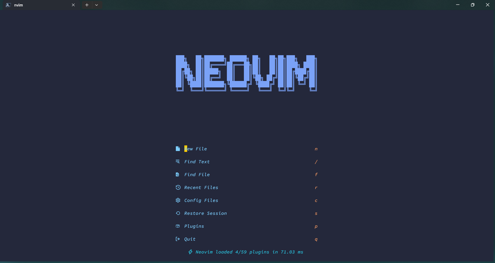
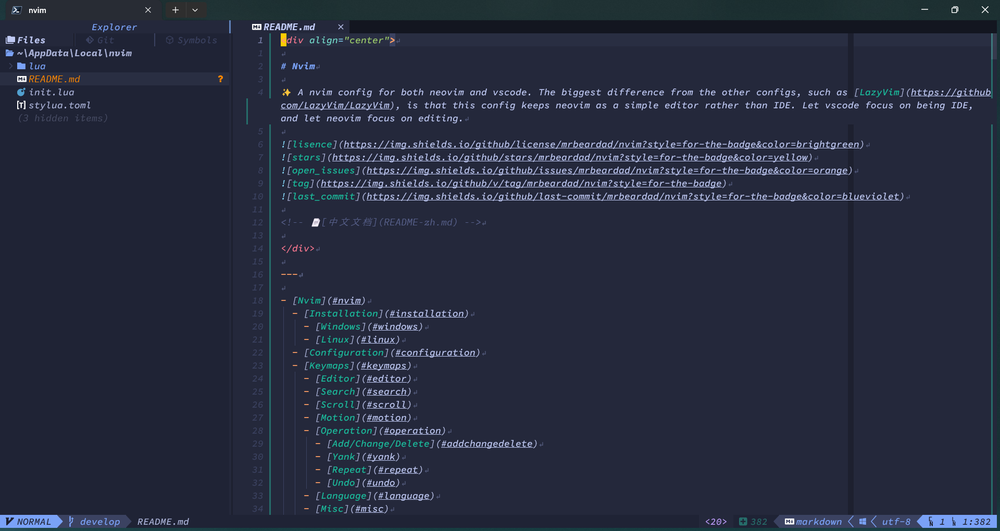

<!-- markdownlint-disable MD013 -->
<div align="center">

# Nvim

✨ A nvim config for both neovim and vscode. Now this config is based on [LazyVim](https://github.com/LazyVim/LazyVim).


<!-- 📄[中文文档](README-zh.md) -->




</div>

---

- [Nvim](#nvim)
  - [Installation](#installation)
    - [Requirements](#requirements)
    - [Windows](#windows)
    - [Linux](#linux)
  - [Configuration](#configuration)
  - [Keymaps](#keymaps)
    - [Editor](#editor)
    - [Search](#search)
    - [Scroll](#scroll)
    - [Motion](#motion)
    - [Operation](#operation)
      - [Add/Change/Delete](#addchangedelete)
      - [Yank](#yank)
      - [Repeat](#repeat)
      - [Undo](#undo)
    - [Language](#language)
    - [Misc](#misc)

## Installation

### [Requirements](https://www.lazyvim.org/#%EF%B8%8F-requirements)

### Windows

```ps1
# required
Move-Item $env:LOCALAPPDATA\nvim $env:LOCALAPPDATA\nvim.bak
# optional but recommended
Move-Item $env:LOCALAPPDATA\nvim-data $env:LOCALAPPDATA\nvim-data.bak
# clone
git clone https://github.com/mrbeardad/nvim $env:LOCALAPPDATA\nvim
# start and install plugins automatically
nvim
```

### Linux

```sh
# required
mv ~/.config/nvim{,.bak}
# optional but recommended
mv ~/.local/share/nvim{,.bak}
mv ~/.local/state/nvim{,.bak}
mv ~/.cache/nvim{,.bak}
# clone
git clone https://github.com/LazyVim/starter ~/.config/nvim
# start and install plugins automatically
nvim
```

## Configuration

Make sure you have added following settings to your vscode settings.json,

```json
  "extensions.experimental.affinity": {
    "asvetliakov.vscode-neovim": 1
  },

  // prettier-ignore
  "vscode-neovim.ctrlKeysForInsertMode": ["w", "a", "e", "o", "h", "u", "d", "k", "r", "n"],
  // prettier-ignore
  "vscode-neovim.ctrlKeysForNormalMode": ["w", "d", "u", "b", "o", "i", "a", "x", "v", "r", "j", "n"],
```

and also add all the [keybindings](https://github.com/mrbeardad/MyIDE/blob/master/vscode/keybindings.json) to your keybindings.json

In most of terminals, `<C-S-*>` and `<C-*>` have the same key sequence.
To distinguish them, map `ctrl+shift+*` to send `<C-S-*>` key sequence in your terminal setting.
For detail see [here](https://www.reddit.com/r/neovim/comments/mbj8m5/how_to_setup_ctrlshiftkey_mappings_in_neovim_and/)

For historical reason, `<Tab>` and `<C-i>` have the same key sequence in most of terminals.
To distinguish them, you could map another key, say `<M-I>`, to `<C-i>` in neovim,
and then map `ctrl+i` to send `<M-I>` key sequence in your terminal setting.
For more info [`:h tui-modifyOtherKeys`](https://neovim.io/doc/user/tui.html#tui-input) and [xterm-modified-keys](https://invisible-island.net/xterm/modified-keys.html)

> My own windows terminal setting is [here](https://github.com/mrbeardad/MyIDE/blob/master/wt/settings.json).

## Keymaps

### Editor

| Neovim Keys | VSCode Keys        | Mode       | Description            |
| ----------- | ------------------ | ---------- | ---------------------- |
| `Space` `e` | `Ctrl`+`Shift`+`E` | **N**      | Open or focus explorer |
| `j`         | `j`                | _Explorer_ | Up                     |
| `k`         | `k`                | _Explorer_ | Down                   |
| `h`         | `h`                | _Explorer_ | Collapse               |
| `l`         | `l`                | _Explorer_ | Expand or open         |
| `a`         | `a`                | _Explorer_ | Add new file/directory |
| `r`         | `r`                | _Explorer_ | Rename                 |
| `y`         | `y`                | _Explorer_ | Copy                   |
| `p`         | `p`                | _Explorer_ | Paste                  |
| `d`         | `d`                | _Explorer_ | Delete                 |
| `c`         | `c`                | _Explorer_ | Copy path              |
| `o`         | `o`                | _Explorer_ | Open by system         |
| `/`         | `/`                | _Explorer_ | Filter                 |
| `?`         |                    | _Explorer_ | Help                   |

| Neovim Keys   | VSCode Keys  | Mode  | Description   |
| ------------- | ------------ | ----- | ------------- |
| `H`           | `H`          | **N** | Previous file |
| `L`           | `L`          | **N** | Next file     |
| `Space` `Tab` | `Ctrl`+`Tab` | **N** | Switch file   |
| `Ctrl`+`S`    | `Ctrl`+`S`   | **N** | Save file     |
| `Space` `bd`  | `Ctrl+W` `q` | **N** | Close file    |

| Neovim Keys    | VSCode Keys    | Mode  | Description                                 |
| -------------- | -------------- | ----- | ------------------------------------------- |
| `Tab`          | `Tab`          | **N** | Next window                                 |
| `Shift`+`Tab`  | `Shift`+`Tab`  | **N** | Previous window                             |
| `Ctrl`+`W` `s` | `Ctrl`+`W` `s` | **N** | Horizontal split window                     |
| `Ctrl`+`W` `v` | `Ctrl`+`W` `v` | **N** | Vertical split window                       |
| `Ctrl`+`W` `=` | `Ctrl`+`W` `=` | **N** | Resize windows                              |
| `Ctrl`+`W` `o` | `Ctrl`+`W` `o` | **N** | Close other windows                         |
| `Ctrl`+`W` `c` | `Ctrl`+`W` `c` | **N** | Close `{count}`-th windows, default current |

> Tips:
>
> 1. The `buffer` in Neovim is similar to the `editor` in VSCode.
> 2. The `window` in Neovim is similar to the `editor group` in VSCode.
> 3. They are just similar rather than equal.

### Search

Use **Search** if the target positon is unknown or too far.

| Neovim Key      | VSCode Key            | Mode        | Description                                                |
| --------------- | --------------------- | ----------- | ---------------------------------------------------------- |
| `/`             | `/`, `Ctrl`+`F`       | **N**       | Search forward in file                                     |
| `?`             | `?`                   | **N**       | Search backward in file                                    |
| `*`             | `*`                   | **N** **V** | Search forward for the word nearest to the cursor in file  |
| `#`             | `#`                   | **N** **V** | Search backward for the word nearest to the cursor in file |
| `n`             | `n`                   | **n**       | Search forwar for last pattern in file                     |
| `N`             | `N`                   | **N**       | Search backward for last pattern in file                   |
| `Space` `/`     | `Ctrl`+`Shift`+`F`    | **N** **V** | Search in workspace                                        |
| `Space` `Space` | `Ctrl`+`P`            | **N**       | Search files in workspace                                  |
| `Space` `r`     | `Ctrl`+`K` `Ctrl`+`R` | **N**       | Search recently opened files                               |
| `Space` `sm`    | _Side Bar_            | **N**       | Search marks                                               |
| `Space` `st`    | _Side Bar_            | **N**       | Search todos                                               |
| `Space` `ss`    | `Ctrl`+`Shift`+`O`    | **N**       | Search symbols in file                                     |
| `Space` `sS`    | `Ctrl`+`T`            | **N**       | Search symbols in workspace                                |
| `gd`            | `gd`                  | **N**       | Go to definition                                           |
| `gy`            | `gy`                  | **N**       | Go to type definition                                      |
| `gr`            | `gr`                  | **N**       | Go to reference                                            |
| `Ctrl`+`/`      |                       | _Picker_    | Help                                                       |

> Tips:
>
> 1. For details of vim regular expression, see [`:h pattern`](https://neovim.io/doc/user/pattern.html#search-pattern)
> 2. For fzf fuzzy search syntax, see [Fzf Search Syntax](https://junegunn.github.io/fzf/search-syntax/)

### Scroll

Use **Scroll** if the target position is roughly known.

| Neovim Keys | VSCode Keys | Mode  | Description                                      |
| ----------- | ----------- | ----- | ------------------------------------------------ |
| `Ctrl`+`D`  | `Ctrl`+`D`  | **N** | Scroll down half screen                          |
| `Ctrl`+`U`  | `Ctrl`+`U`  | **N** | Scroll up half screen                            |
| `Ctrl`+`F`  |             | **N** | Scroll down full screen                          |
| `Ctrl`+`B`  | `Ctrl`+`B`  | **N** | Scroll up full screen                            |
| `gg`        | `gg`        | **N** | Go to first line                                 |
| `G`         | `G`         | **N** | Go to `{count}`-th line, default last line       |
| `zz`        | `zz`        | **N** | Scroll to leave current line at center of screen |
| `M`         | `M`         | **N** | Move cursor to center of screen                  |
| `Alt`+`F`   | `Alt`+`F`   | **N** | Scroll left                                      |
| `Alt`+`B`   | `Alt`+`F`   | **N** | Scroll right                                     |

### Motion

Use **Motion** if the target position is exactly known.

| Key              | Mode        | Description                                               |
| ---------------- | ----------- | --------------------------------------------------------- |
| `h`              | **N** **V** | Move left                                                 |
| `l`              | **N** **V** | Move right                                                |
| `j`              | **N** **V** | Move up                                                   |
| `k`              | **N** **V** | Move down                                                 |
| `0`              | **N** **V** | Move to the start of the line                             |
| `$`              | **N** **V** | Move to the end of the line                               |
| `Ctrl`+`A`       | **I**       | Move to the start of the line                             |
| `Ctrl`+`E`       | **I**       | Move to the end of the line                               |
| `f` `{char}`     | **N** **V** | Jump to the next position of `{char}`                     |
| `F` `{char}`     | **N** **V** | Jump to the previous position of `{char}`                 |
| `t` `{char}`     | **N** **V** | Jump to the next position before `{char}`                 |
| `T` `{char}`     | **N** **V** | Jump to the previous position after `{char}`              |
| `m` `{mark}`     | **N**       | Set a mark                                                |
| `` ` `` `{mark}` | **N**       | Jump to mark                                              |
| `Ctrl`+`O`       | **N**       | Go to older cursor position in jump list (not a motion)   |
| `Ctrl`+`I`       | **N**       | Go to newer cursor position in jump list (not a motion)   |
| `g;`             | **N**       | Go to older cursor position in change list (not a motion) |
| `g,`             | **N**       | Go to newer cursor position in change list (not a motion) |

> Tips:
>
> - **Jump** is command that normally moves the cursor several lines away.
>   If you make the cursor "jump", the position of the cursor before the jump is remembered in jump list.
>   For details, see [`:h jump-motions`](https://neovim.io/doc/user/motion.html#jump-motions)

| Text Object (omit `a`/`i`) | Motions                       | Description                                     |
| -------------------------- | ----------------------------- | ----------------------------------------------- |
| `?`                        |                               | User prompt surround                            |
| `{char}`                   |                               | Character surround (support punction and digit) |
| `q`                        |                               | Quote surround, `""` `''` ` `` `                |
| `b`                        |                               | Bracket surround, `{}` `[]` `()` `<>`           |
| `t`                        |                               | Tag surround, `<tag></tag>`                     |
| `w`, `e`                   | `w` `b` `e`                   | word                                            |
| `W`, `E`                   | `W` `B` `E`                   | WORD                                            |
| `p`                        | `{` `}`                       | Paragraph                                       |
| `g`                        |                               | Entire file                                     |
| `i`                        | `[i` `]i`                     | Indent                                          |
| `o`                        |                               | Block/Loop/Condition                            |
| `a`                        | `[a` `]a`                     | Argument                                        |
| `f`                        | `[f` `]f`                     | Function                                        |
| `u`                        |                               | Function usage (calling)                        |
| `c`                        | `[c` `]c`                     | Type definition                                 |
|                            | `[d` `]d` `[e` `]e` `[w` `]w` | Diagnostics/Error/Warning                       |
|                            | `[h` `]h`                     | Hunks (Git change or diff)                      |

| Visual Selection Keys | Mode        | Description                                                                          |
| --------------------- | ----------- | ------------------------------------------------------------------------------------ |
| `v`                   | **N** **V** | Charwise visual selection                                                            |
| `V`                   | **N** **V** | Linewise visual selection                                                            |
| `Ctrl`+`V`            | **N** **V** | Blockwise visual selection                                                           |
| `o`                   | **V**       | Move cursor to begin or end of selection region, so you can tweek the range manually |
| `a`/`i` `{textobj}`   | **V**       | Expand selection to fit outter text object, else select next text object             |
| `an`/`in` `{textobj}` | **V**       | Select next/previous text object                                                     |
| `al`/`il` `{textobj}` | **V**       | Select next/previous text object                                                     |

### Operation

#### Add/Change/Delete

> Tips:
>
> - Operator + `[count]` Motion = Do operator for all text from the start position to the end position
> - Operator + `[count]` Text-Object = Do operator for all text in text object
> - `{Visual}` Operator = Do operator for visual selected text

| Operator | Mode        | Description           | Comment                                                    |
| -------- | ----------- | --------------------- | ---------------------------------------------------------- |
| `gu`     | **N** **V** | Make text lowercase   | `guu`=`0gu$`, `vu`=`vgu`                                   |
| `gU`     | **N** **V** | Make text uppercase   | `gUU`=`0gU$`, `vU`=`vgU`                                   |
| `g~`     | **N** **V** | Switch case of text   | `g~~`=`0g~$`, `v~`=`vg~`, `~`=`g~l`                        |
| `c`      | **N** **V** | Change text           | `Alt`+`c`=`"_c`, `cc`=`0c$`, `C`=`c$`, `s`=`cl`            |
| `d`      | **N** **V** | Delete text           | `Alt`+`d`=`"_d`, `dd`=`0v$d`, `D`=`d$`, `x`=`dl`, `X`=`dh` |
| `y`      | **N** **V** | Yank (Copy) text      | `yy`=`0v$y`, `Y`=`y$`                                      |
| `v`      | **N**       | Start charwise visual | `v$` will cover the EOL                                    |

| Normal Key               | Mode                | Description                                          |
| ------------------------ | ------------------- | ---------------------------------------------------- |
| `Esc`                    | **ALL**             | Return to normal mode                                |
| `ys` `{motion}` `{char}` | **N** **V**         | Add surround around `{motion}` with `{char}`         |
| `cs` `{char1}` `{char2}` | **N**               | Change the surrounding pair `{char}` with `{char2}`  |
| `ds` `{char}`            | **N**               | Delete the surrounding pair `{char}`                 |
| `r` `{char}`             | **N** **V**         | Replace the character under the cursor with `{char}` |
| `J`                      | **N** **V**         | Join lines into one line                             |
| `<`                      | **N** **V**         | Shift lines left                                     |
| `>`                      | **N** **V**         | Shift lines right                                    |
| `Alt`+`J`                | **I**, **N**, **V** | Move line Down                                       |
| `Alt`+`K`                | **I**, **N**, **V** | Move line Up                                         |
| `Ctrl`+`A`               | **N**               | Add to the number under cursor                       |
| `Ctrl`+`X`               | **N**               | Subtract from the number under cursor                |
| `]` `Space`              | **N**               | Add empty line below                                 |
| `[` `Space`              | **N**               | Add empty line above                                 |

| Insert Key | Mode  | Description                                    |
| ---------- | ----- | ---------------------------------------------- |
| `i`        | **N** | Insert before the cursor                       |
| `a`        | **N** | Insert after the cursor                        |
| `I`        | **N** | Insert before the first non-blank in the line  |
| `A`        | **N** | Insert before the end of the line              |
| `o`        | **N** | Insert a new line below the cursor             |
| `O`        | **N** | Insert a new line above the cursor             |
| `Ctrl`+`O` | **I** | Execute one command then return to Insert mode |
| `Ctrl`+`H` | **I** | Delete left                                    |
| `Ctrl`+`W` | **I** | Delete left word                               |
| `Ctrl`+`U` | **I** | Delete all left                                |
| `Ctrl`+`D` | **I** | Delete right                                   |
| `Alt`+`D`  | **I** | Delete right word                              |
| `Ctrl`+`K` | **I** | Delete all right                               |

#### Yank

| Key                              | Mode        | Description                               |
| -------------------------------- | ----------- | ----------------------------------------- |
| `"` `{register}` `{yank or put}` | **N** **V** | Use `{register}` to yank or paste         |
| `Ctrl`+`R` `{register}`          | **I**       | Paste text from `{register}`              |
| `y`                              | **N** **V** | Copy text                                 |
| `p`                              | **N** **V** | Paste text after cursor                   |
| `P`                              | **N**       | Paste text before cursor                  |
| `gp`                             | **N**       | Paste text below current line             |
| `gP`                             | **N**       | Paste text above current line             |
| `zp`                             | **N** **V** | Paste last yanked text after cursor       |
| `zP`                             | **N**       | Paste last yanked text before cursor      |
| `zgp`\|`gzp`                     | **N**       | Paste last yanked text below current line |
| `zgP`\|`gzP`                     | **N**       | Paste last yanked text above current line |
| `[y`\|`[p`                       | **N**       | Cycle forward through yank history        |
| `]y`\|`]p`                       | **N**       | Cycle backward through yank history       |
| `Ctrl`+`C`                       | **V**       | Copy (VSCode only)                        |
| `Ctrl`+`V`                       | **I** **V** | Paste last yanked                         |
| `Space` `p`                      | **N**       | Search yank history                       |

> Tips
>
> - Commonly used registers (With [yanky](https://github.com/gbprod/yanky.nvim) installed)
>   1. `"`: laste changed, deleted or yanked
>   2. `1-9`: history of deleted, changed or yanked
>   3. `0`: last yanked
>   4. `-`: last short changed or deleted (didn't across multiple lines)
>   5. `.`: last inserted text
>   6. `:`: last command line
>   7. `/`: last search pattern
> - Use `` `[ `` or `` `] `` to jump to the start or end of last changed or yanked text.

#### Repeat

| Key                | Mode  | Description                                              |
| ------------------ | ----- | -------------------------------------------------------- |
| `.`                | **N** | Repeat last change                                       |
| `q` `{register}`   | **N** | Record typed characters into register, `q` again to stop |
| `@` `{register}`   | **N** | Execute the contents of register                         |
| `@@`               | **N** | Repeat Previous `@`                                      |
| `Q`                | **N** | Repeat the last recorded register                        |
| `Ctrl`+`J`         | **N** | Add cursor downward                                      |
| `Ctrl`+`Shift`+`J` | **N** | Move cursor down                                         |
| `Ctrl`+`K`         | **N** | Add cursor upward                                        |
| `Ctrl`+`Shift`+`K` | **N** | Move cursor up                                           |
| `Ctrl`+`N`         | **N** | Add selection at next find match                         |
| `Ctrl`+`Shift`+`N` | **N** | Move selection to next find match                        |
| `Ctrl`+`Shift`+`L` | **N** | Add selection at all find match                          |
| `Space` `mw`       | **N** | Add cursor at selected word                              |
| `Space` `mm`       | **N** | Add cursor at selected pattern match                     |

> Tips
>
> There is more than one method for complex repetitive editing: (from easy to difficult)
>
> 1. Dot repeat `.`
> 2. Multiple cursors
> 3. Substitute command `:%s/pat/repl/[flag]`
> 4. Macro `q`/`@`

#### Undo

| Key          | Mode  | Description         |
| ------------ | ----- | ------------------- |
| `u`          | **N** | Undo                |
| `Ctrl`+`R`   | **N** | Redo                |
| `Ctrl`+`Z`   | **I** | Undo                |
| `Space` `su` | **N** | Search undo history |

### Language

| Key               | Mode              | Description                                   |
| ----------------- | ----------------- | --------------------------------------------- |
| `Ctrl`+`N`        | **I**             | Select next item, or show completion menu     |
| `Ctrl`+`P`        | **I**             | Select previous item, or show completion menu |
| `Tab`             | **I**             | Confirm selected item and insert it           |
| `Shift`+`Tab`     | **I**             | Confirm selected item and replace with it     |
| `Tab`             | **I**             | Jump to next snippet placeholder              |
| `Shift`+`Tab`     | **I**             | Jump to previous snippet placeholder          |
| `K`               | **N**             | Signature infomation                          |
| `F2`              | **N**             | Rename symbol                                 |
| `Ctrl`+`.`        | **N**             | Code Action                                   |
| `Ctrl`+`/`        | **I** **N** **V** | Comment code                                  |
| `Alt`+`Shift`+`F` | **I** **N** **V** | Format code                                   |

### Misc

| Key            | Mode  | Description     |
| -------------- | ----- | --------------- |
| `Ctrl`+`` ` `` | **N** | Toggle terminal |
| `Space` `n`    | **N** | Toggle output   |
| `Alt`+`Z`      | **N** | Toggle wrap     |
| `za`           | **N** | Toggle fold     |
| `ga`           | **N** | Unicode point   |
| `g8`           | **N** | utf-8 encoding  |
