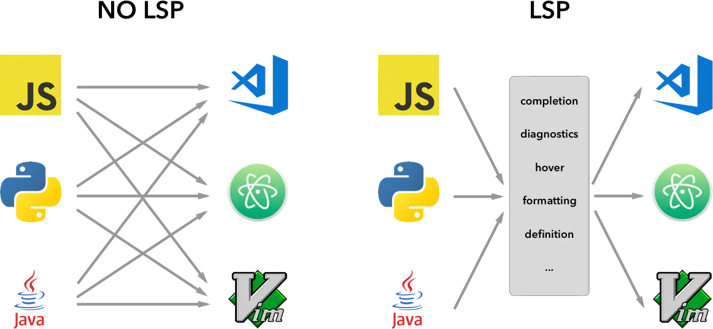

[English Doc](README.en.md)

# LunarVim: Code on Neovim

- [LunarVim: Code on Neovim](#lunarvim-code-on-neovim)
  - [前言](#前言)
  - [安装](#安装)
  - [如何定制](#如何定制)
    - [Language Server](#language-server)
    - [Linter](#linter)
    - [Formatter](#formatter)
    - [Syntax](#syntax)
  - [快捷键](#快捷键)

## 前言

自从 NeoVim 支持[LSP](https://microsoft.github.io/language-server-protocol/)并转用[Lua](https://www.lua.org/about.html)作为首席插件语言代替又丑又慢 VimL 后, 使用体验直接翻倍。
[LunarVim](https://github.com/LunarVim/LunarVim)就是基于全新 Neovim Lua 生态打造的配置集合, 旨在将 Neovim 打造成高性能的 IDE.迁移到 LunarVim 后, nvim 启动时间从原来的 829.953ms 降到了 187.835ms.

## 安装

首先你需要安装[LunarVim](<[https://](https://www.lunarvim.org/01-installing.html#installation)>), 安装依赖包括:

1. [neovim-0.7](https://github.com/neovim/neovim/releases)或以上版本
2. [git](https://git-scm.com/downloads)
3. [python pip](https://pip.pypa.io/en/stable/installation/)
4. [nodejs npm](https://www.npmjs.com/)
5. [rust cargo](https://www.rust-lang.org/)(可选, 你可以手动安装 ripgrep 和 fd-find)

```sh
bash <(curl -s https://raw.githubusercontent.com/lunarvim/lunarvim/master/utils/installer/install.sh)
```

如上, 官方的安装脚本会提示你是否需要自动安装依赖, 可能会有如下问题:

1. 记得挂梯子 [(✿◡‿◡)](## "真的会谢")
2. 记得设置 npm 的 prefix 以设置可访问的全局安装路径

   ```sh
   npm config set perfix ~/.local
   ```

3. 你可能需要将 _~/.cargo/bin_ 加入你的环境变量`PATH`

然后, 安装本配置:

```sh
# backup original config
mv ~/.config/lvim{,.bak}
# install my config
git clone https://github.com/mrbeardad/MyLunarVim ~/.config/lvim
# install all plugins
lvim --headless -c 'autocmd User PackerComplete quitall' -c 'PackerSync'
```

`lvim`是 LunarVim 官方提供的启动脚本, 可以与原来的配置隔离开来.

## 如何定制

搭建一个语言的开发环境, 你需要什么?

> 提示: 快捷键`Space L i`或命令`:LvimInfo`可查看当前语言服务信息

### [Language Server](https://microsoft.github.io/language-server-protocol/implementors/servers/)



最初由微软提议的语言服务协议(LSP)现在可谓百花齐放, 它运行在后台解析代码符号并指导客户端编辑器的行为: 代码补全, 语法提示, 代码格式化, 类型提示, 文档提示, 代码导航, 符号搜索, 重构等等功能.

现在 Neovim 已内建支持 LSP, 不再像以前那样, 有许多配置提供都能提供以上功能, 要想获取结果就要针对每个插件都做适配. Neovim 内建 LSP 后提供了同一接口获取有关信息, 极大方便了插件生态发展.

LunarVim 默认当你打开文件时自动下载对应 Language Server, 你可能有如下情景:

- 有些时候自动安装会有问题, 可尝试手动安装`:LspInstall <language server>`查看一下报错信息.(按 Tab 会自动补全 language server)
- 对于某种语言换用非默认 lanuage server, 以 python 为例

  1. 在 config.lua 中添加,

     ```lua
     vim.list_extend(lvim.lsp.automatic_configuration.skipped_servers, { "pyright" }) -- 关闭默认的pyright
     ```

  2. 保存执行`:LvimCacheReset`重置原有 language server 配置缓存

  3. 在~/.config/lvim/after/ftplugin/python.lua 中添加:(文件不存在则手动创建)

     ```lua
     require("lvim.lsp.manager").setup("jedi_language_server")
     ```

- 修改 language server 启动参数等, 执行`:LspSettings <language server>`(Tab 补全), 这会以 json 格式编写配置, 示例见[nlsp-settings](https://github.com/tamago324/nlsp-settings.nvim/tree/main/schemas/_generated)(安装 jsonls 可有自动补全功能哦)

### [Linter](https://github.com/caramelomartins/awesome-linters)

静态分析器可以为你的代码提供额外的提醒警告, 例如指出某些代码风格的问题, 以及一些常见的 bug. 大多数语言服务提供的语法警告功能并不强大, 也仅仅是语法级别的错误提示, 所以才需要额外的静态解析器.

LunarVim 默认均未启动 Linter 与 Formatter, 创建`~/.config/lvim/after/ftplugin/<lang_type>.lua`, 并添加启动代码即可, 示例可见[LunarVim](https://www.lunarvim.org/languages/#linting-formatting).

你可以执行`:NulllsInfo`查看当前文件类型对应可用的 Linter 和 Formatter

```lua
local formatters = require "lvim.lsp.null-ls.formatters"
formatters.setup {
  { command = "black" },
  {
    command = "prettier",
    args = { "--print-width", "100" },
    filetypes = { "typescript", "typescriptreact" },
  },
}

local linters = require "lvim.lsp.null-ls.linters"
linters.setup {
  { command = "flake8" },
  {
    command = "shellcheck",
    args = { "--severity", "warning" },
  },
  {
    command = "codespell",
    filetypes = { "javascript", "python" },
  },
}

local code_actions = require "lvim.lsp.null-ls.code_actions"
code_actions.setup {
  {
    command = "proselint"
  },
}
```

### Formatter

代码格式化工具, 一些 Language Server 并未内置格式化功能, 此时需要借助外部工具. 配置同上[Linter](#linter)

### Syntax

良好的语法高亮可以让我们的代码看起来更舒服, 让我们更容易区分语句,函数,变量等.

[nvim-treesitter](https://github.com/nvim-treesitter/nvim-treesitter)为此而生, 它会对代码进行语法解析, 高亮更加精准.

在 config.lua 中设置添加你的语言:

```lua
lvim.builtin.treesitter.ensure_installed = {
  "bash",
  "vim",
  "lua",
  "c",
  "cpp",
  "cmake",
  "go",
  "python",
  "javascript",
  "typescript",
  "tsx",
  "html",
  "css",
  "markdown",
  "json",
  "yaml",
}
```

## 快捷键

基本与[我的 VSCode 配置](https://github.com/mrbeardad/MyIDE/blob/master/vscode.md)相同, 为了在终端中使用 ctrl+shift 开头的按键,以及区分 Tab 和 Ctrl+i, 我重映射了我的终端按键, 将它们映射到一些不常用按键上, 所有相关按键都在[config.lua](config.lua)中标记为 HACK, 你可以尽情修改.

我的 Windows Terminal 部分配置

```json
{
  "actions": [
    {
      "keys": "ctrl+shift+f",
      "command": {
        "action": "sendInput",
        "input": "\u001bf" // <M-f>
      }
    },
    {
      "keys": "ctrl+shift+h",
      "command": {
        "action": "sendInput",
        "input": "\u001bH" // <M-H>
      }
    },
    {
      "keys": "ctrl+alt+enter",
      "command": {
        "action": "sendInput",
        "input": "\u001b\u000d" // <M-CR>
      }
    },
    {
      "command": {
        "action": "sendInput",
        "input": "\u001bI"
      },
      "keys": "ctrl+i" // <M-I>
    },
    {
      "keys": "ctrl+shift+j",
      "command": {
        "action": "sendInput",
        "input": "\u001bJ" // <M-J>
      }
    },
    {
      "keys": "ctrl+shift+k",
      "command": {
        "action": "sendInput",
        "input": "\u001bK" // <M-K>
      }
    },
    {
      "keys": "ctrl+shift+l",
      "command": {
        "action": "sendInput",
        "input": "\u001bL" // <M-L>
      }
    },
    {
      "keys": "ctrl+shift+s",
      "command": {
        "action": "sendInput",
        "input": "\u001bS" // <M-S>
      }
    },
    {
      "keys": "ctrl+shift+o",
      "command": {
        "action": "sendInput",
        "input": "\u001bO" // <M-O>
      }
    },
    {
      "keys": "ctrl+shift+n",
      "command": {
        "action": "sendInput",
        "input": "\u001bN" // <M-N>
      }
    },
    {
      "keys": "ctrl+shift+m",
      "command": {
        "action": "sendInput",
        "input": "\u001bM" // <M-M>
      }
    },
    {
      "keys": "ctrl+.",
      "command": {
        "action": "sendInput",
        "input": "\u001b." // <M-.>
      }
    },
    {
      "keys": "ctrl+shift+p",
      "command": {
        "action": "sendInput",
        "input": "\u001bP" // <M-P>
      }
    }
  ]
}
```
